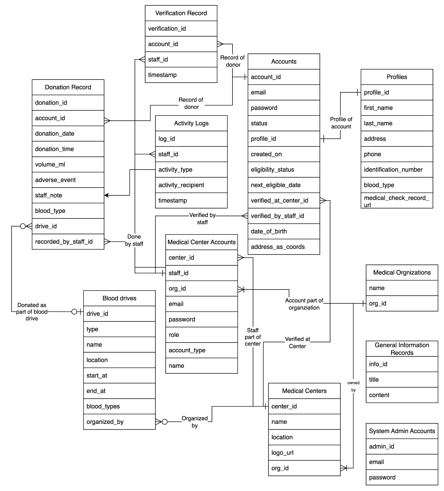

# Data Model and ER Diagram

## ER Diagram

The overall entity-relationship (ER) diagram for HemaWeb captures core entities such as accounts, medical organizations, centers, staff/admin accounts, drives, and donation records.

Key high-level entities include:

- **Accounts** – Donor login accounts.
- **Profiles** – Donor profile data linked to accounts.
- **Medical Organizations** – Top-level organizations partnering with HemaWeb.
- **Medical Centers** – Hospitals/clinics under organizations.
- **Medical Center Accounts** – Staff/admin/super admin accounts.
- **Activity Logs** – Audit logs of staff/admin actions.
- **Blood Drives** – Donation events (scheduled or emergency).
- **Donation Records** – Stored records of individual donations.
- **Verification Records** – Stored records of donor verification actions.
- **General Information Records** – Informational articles and content.
- **System Admin Accounts** – Accounts for platform-level system administrators.

## Data Dictionary (Structure Overview)

The original specification lists the following tables; detailed column definitions can be filled in during implementation:

### Accounts Table

- Stores login credentials and basic account metadata for donors.

### Profiles Table

- Stores personal and medical profile information linked to accounts.

### Medical Organizations Table

- Represents top-level medical organizations.

### Medical Centers Table

- Represents individual hospitals/clinics under medical organizations.

### Medical Center Accounts Table

- Stores staff/admin/super admin accounts tied to medical centers and organizations.

### Activity Logs Table

- Stores audit logs of actions performed by medical center accounts.

### Blood Drives Table

- Stores metadata for blood drives (type, location, schedule, status, target blood type, etc.).

### Donation Record Table

- Stores individual donation records, including donor, center, date, volume, and related drive.

### Verification Record Table

- Stores donor verification actions by staff, including result and document references.

### General Information Records Table

- Stores educational and informational content about blood donation.

### System Admin Accounts Table

- Stores accounts for system administrators managing organizations and global content.

