# User Interface – Donor (Mobile Web)

This document summarizes the donor-facing mobile web UI screens. All screenshots are located in `./images/ui/donor/`.

## Authentication Screens

Donors authenticate through a mobile-friendly flow for login and registration.

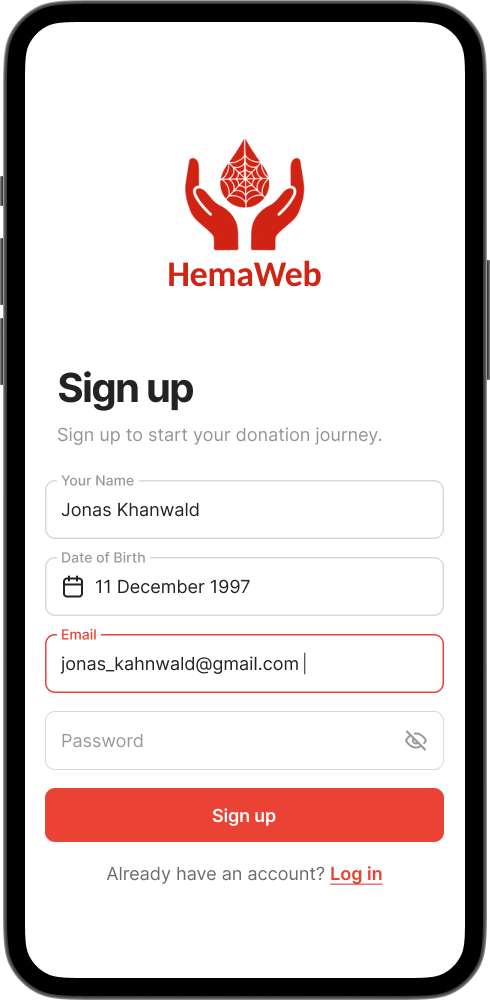

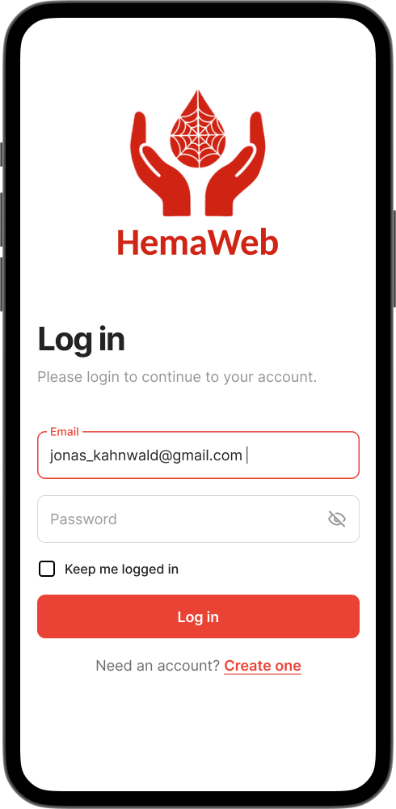

## Unverified User Screens

Unverified users see:

- Informational home content about blood donation.
- A map of nearby partner hospitals.
- Account/profile settings.

### Home and Information

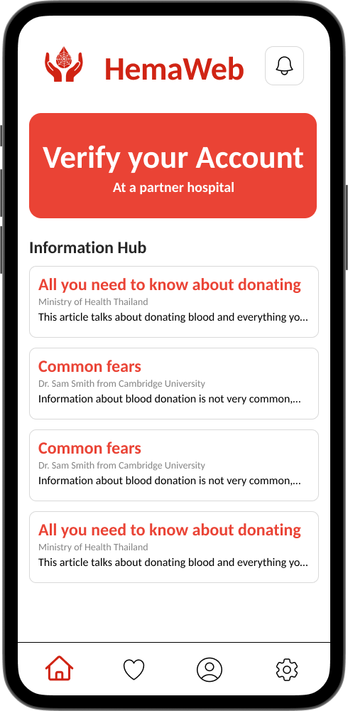

### Map of Medical Centers

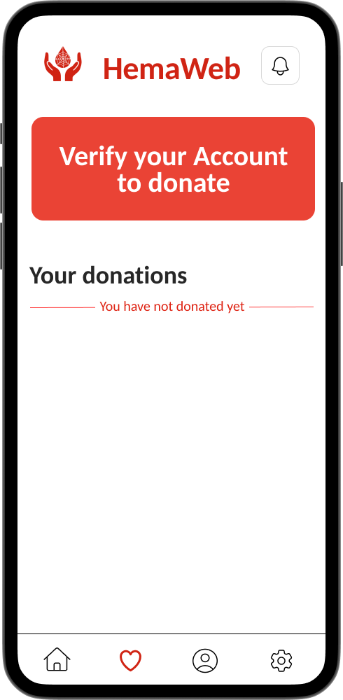

### Educational Content

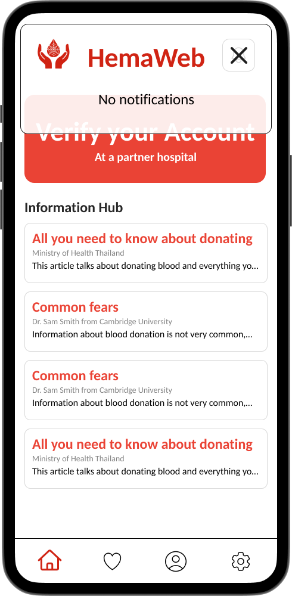

### Additional Screens

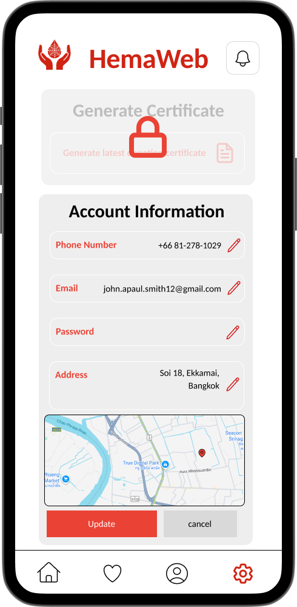

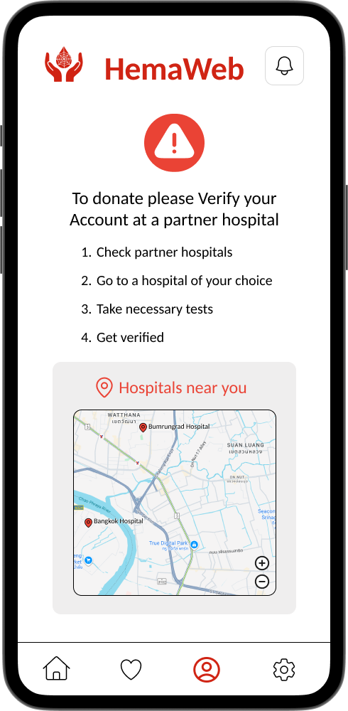

### Profile and Settings

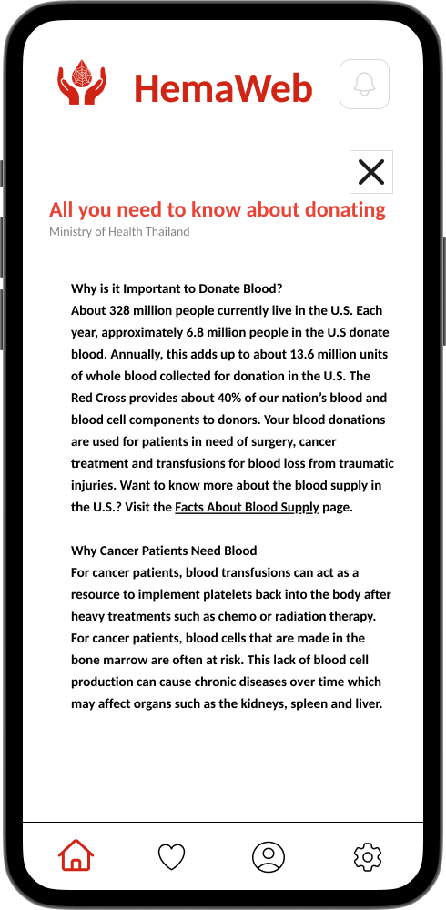

## Verified User Screens

Verified donors see additional features:

- Nearby blood drives and emergency requests matching their blood type.
- Donation cooldown status and a message when they are eligible to donate.
- Donation history (past donations, locations, dates, and volumes).
- Availability status controls.
- Access to request a donation certificate.

### Home with Blood Drives

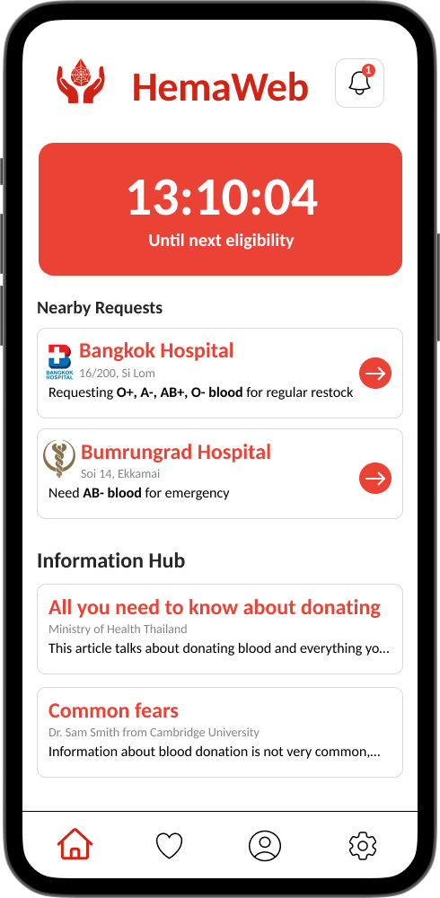

### Donation Cooldown

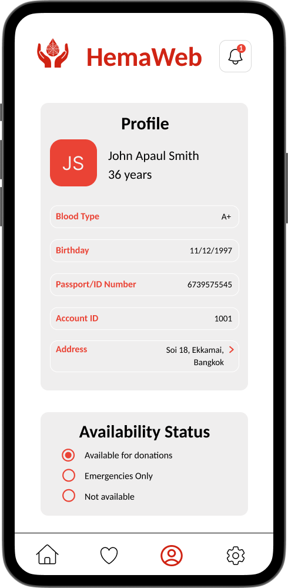

### Donation History

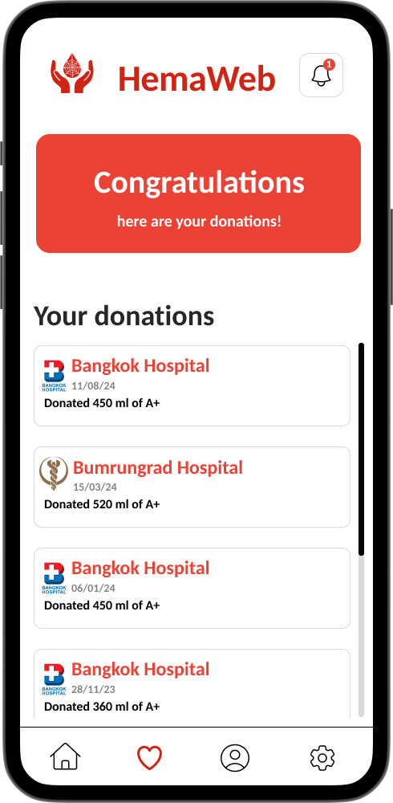

### Availability Status

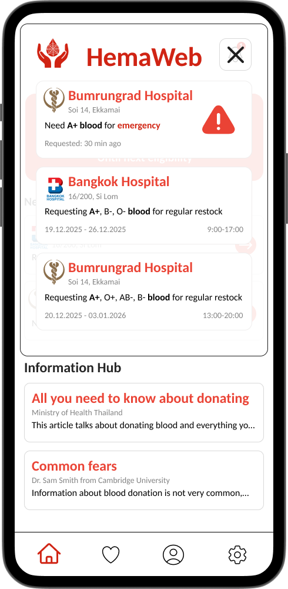

### Certificate and Other Features

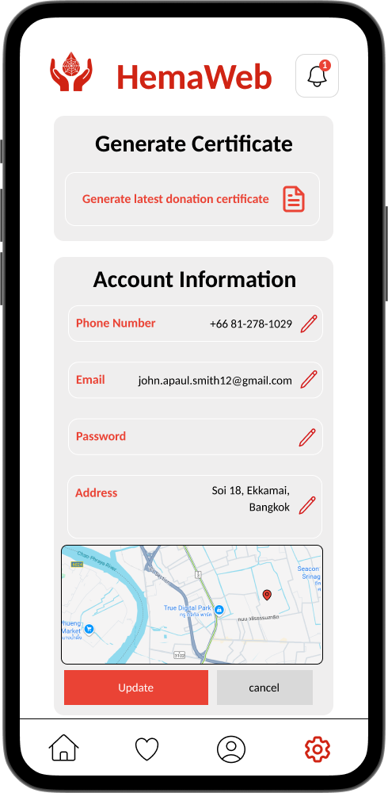
